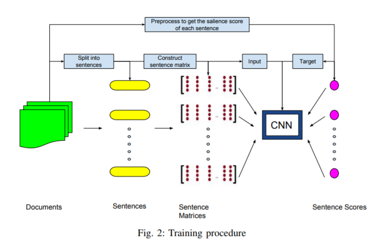
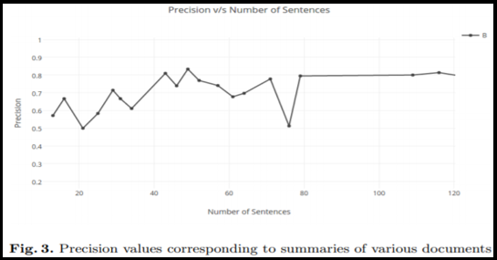
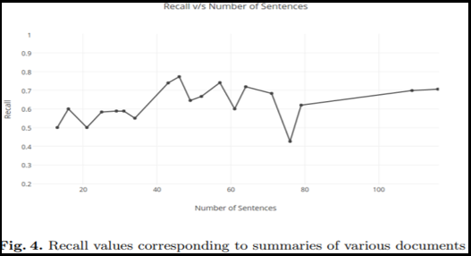
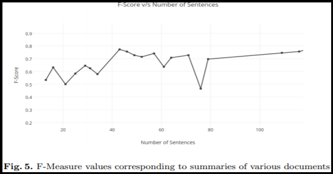

# Extractive Text Summarization - Deep Learning

## Project Title ##  
Extractive Text Summarization  
(An approach for generating short and precise summaries for long text documents using the implementation of Deep Belief Neural Networks)

## Project Idea Description ## 
The size of information on the internet is increasing. It has become tough for the users to dig into the loads of information to analyze it and draw conclusions. Earlier, humans used to summarize the text by their own, but today due to increasing data, it is difficult for the human beings to cope up with the huge data due to which the time required for the users to summarize and analyse the huge data is increased.

Convolutional neural networks (CNN) is originally proposed for computer vision by LeCun et al. It produces excellent results for computer vision tasks and recently has been proven to be effective for various NLP tasks as well, such as POS tagging, sentence modeling, semantic embedding and sentence classification, to name a few. 

Text summarization solves this problem by generating a summary, selecting sentences which are most important from the document without losing the information. The solution to reduce reading time of the user is producing a succinct document summary.

## Abstract ##  
Text Summarization is the process of obtaining salient information from an authentic text document. In this technique, the extracted information is achieved as a summarized report and conferred as a concise summary to the user; it is challenging for the user to verve through altogether the information accessible on web.

Reduction of text is a very complex problem which, in spite of the progress in the area thus far, poses many challenges to the scientific community. It is also relevant application in today’s information society given the exponential growth of textual information online and the need to promptly assess the contents of text collections. It has long been assumed that summarization presupposes to understand the input text, which means for identifying the important point of the document, explicit representation of the text must be calculated therefore, text summarization became an interesting application to test the understanding capabilities of artificial systems.

## Approach ##  
The objective of this project building a neural network with TensorFlow that can create relevant summaries for the dataset. To build our model we will use a two-layered bidirectional RNN with LSTMs on the input data and two layers, each with an LSTM on the target data. The deep network power is capable of
1. analysing sequences of input
2. understanding text
3. outputting sequences of output in form of summarizes
hence the name of sequence 2 sequence(seq2seq), sequence of inputs to sequence of outputs, which is the main algorithm that we use in building the model.

## Architecture Diagram ##

## Implementation ##

* 	Data Pre-processing:
    1.Ambiguities is caused by various verb sorts of one word, different accepted spellings of a specific word, plural and singular terms of the identical things. Moreover,         words sort of a, an, the, is, of etc. are referred to as stop words. These are certain high frequency words that don't carry any information and don’t serve any purpose       towards our goal of summarization. 
    2.All the pre-processing steps are carried out using a library in python called as Natural Language Toolkit (NLTK). 
    3.During this phase we do:
      Document Segmentation
      Paragraph Segmentation
      Word Normalization
      Stop Word Filtering
      PoS Tagging

* 	Feature Extraction:
    1.Once the complexity has been reduced and ambiguities are removed, the document is structured into a sentence-feature matrix. 
    2.A feature vector is extracted for every sentence. These feature vectors frame the matrix. 
    3.The mix of the subsequent 9 sentence features has clad best suited to summarize factual reports.
    4.These computations are done on the text obtained after the pre-processing phase: Number of thematic words, Sentence position, Sentence length, Sentence position               relative to paragraph etc.

* 	Feature Enhancement:
    1.The sentence-feature matrix has been generated with each sentence having 9 feature vector values. 
    2.After this, recalculation is completed on this matrix to reinforce and abstract the feature vectors, so on build complex features out of easy ones. This step improves         the standard of the summary.
    3.The RBM that we are using has 9 perceptrons in each layer with a learning rate of 0.1. 
    4.We've trained RBM for fourteen epochs with a batch size of 5 and 5 parallel Gibbs Chains, used for sampling using Persistent CD method. 

* 	Summary Generation:
    1.The enhanced feature vector values are summed to come up with a score against each sentence. The sentences are then sorted in line with decreasing score value. 
    2.The foremost relevant sentence is that the first sentence during this sorted list and is chosen as a part of the subset of sentences which can form the summary. 
    3.This process is recursively and incrementally repeated to pick out more sentences until a user specified summary limit is reached.
    4.The sentences are then re-arranged within the order of appearance within the original text. This produces a coherent summary instead of a group of haywire sentences.

## Results ##

* 	We have tested the model on several text articles and generated the output(a summary of respective article) and attached are the results for reference:
    Several factual reports from various domains of health, technology, news, sports etc. with varying number of sentences were used for experimentation and evaluation. The       proposed algorithm was run on each of these and system-generated summaries were compared to the summaries produced by humans.
    
    
    
    Feature Extraction and Enhancement is disbursed as proposed in above sections for all documents. The values of feature vector and enhanced feature vector for every           sentence of 1 such document are plotted in Fig 2. The Restricted Boltzmann Machine has extracted a hierarchical representation out of information that originally didn't       have much variation, hence discovering the latent factors. The sentences have then been ranked on the premise of ultimate feature vector and summaries are generated.
    
    
    
    Evaluation of the system-generated summaries is completed supported three basic measures: Precision, Recall and F-Measure [18].
    
    
    
    It is seen that because the number of sentences within the original document cross a particular threshold, the Restricted Boltzmann Machine has ample data to be trained        successfully and summaries with high precision and recall values are generated. See Fig 3 and 4.
    
    

## Video Trailer ##

https://drive.google.com/file/d/13EkBTePW0gT34RsDSHUxXeSi6aDUVtpX/view?usp=sharing

